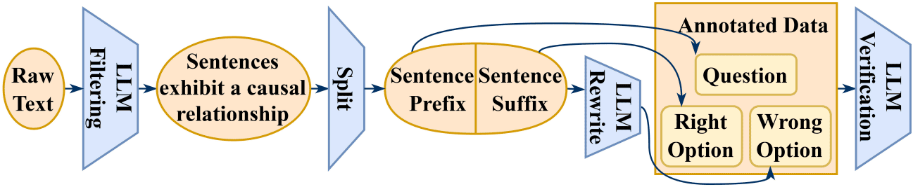

### How to run the evaluations

As illustrated in the following figure, we have built a sentence continuation task, and both the code and results are located in the `icl_eval/continuation` folder.
<p align="center">
  
</p>

To evaluate model performance, please install the `lm-eval` package from the `lm-evaluation-harness` repository using the following command:
```bash
git clone https://github.com/EleutherAI/lm-evaluation-harness
cd lm-evaluation-harness
pip install -e .
```
After installation, move your `icl_eval/continuation/lm_eval` directory to the `lm-evaluation-harness` directory. Then, refer to `run_eval.sh` for instructions on running evaluations with both the pruned and source models.

### Metrics for each task
We use the following metrics for each task:

| Task              | Metric                |
|------------------|----------------------|
| arc_challenge    | acc_norm             |
| arc_easy         | acc                  |
| lambada_openai   | acc                  |
| squad            | HasAns_f1            |
| logiqa           | acc_norm             |
| piqa             | acc                  |
| sciq             | acc                  |
| winogrande       | acc                  |
| wsc              | acc                  |
| hellaswag        | acc_norm |
| truthfulqa_mc    | mc2     |
| triviaqa         | exact_match  |
| mmlu             | acc          |
| gsm8k            | acc          |
| boolq            | acc        |
| nq_open          | exact_match     |
| xnli             | acc             |
| xstorycloze      | acc             |
| xwinograd        | acc             |
| paws             | acc             |
| continuation     | acc             |
